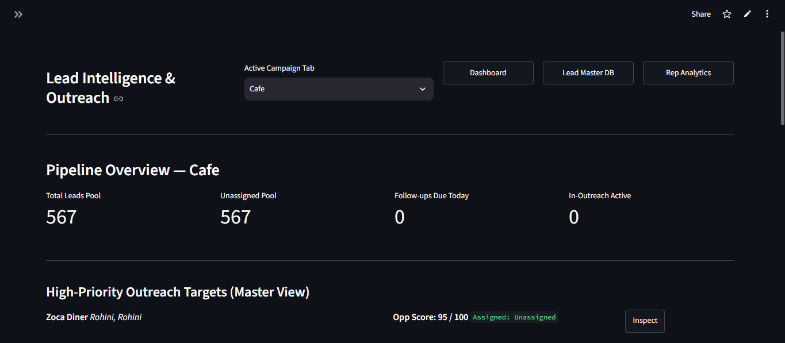
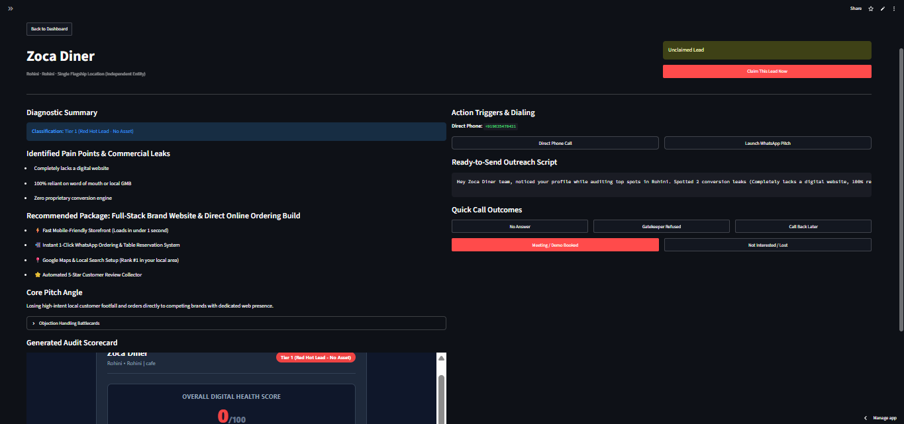

<p align="center">
  
</p>

<h1 align="center">Google Business Platform</h1>

<p align="center">
  Enterprise Lead Intelligence & Technical Audit Workspace
</p>

---

## Overview

Google Business Platform is a full-stack lead intelligence system that transforms raw Google Business data into prioritized, sales-ready opportunities.

The platform combines automated business discovery, technical website audits, AI-assisted outreach generation, and a centralized sales dashboard into a single workflow for outbound teams.

## Product

<p align="center">
  
</p>

The dashboard provides a live workspace for sales representatives to manage campaigns, inspect opportunities, track outreach activity, and prioritize leads using an opportunity scoring system.

## Pipeline

```text
Google Business Data
        │
        ▼
Normalization & Deduplication
        │
        ▼
Technical Website Audit
        │
        ▼
Lead Intelligence Engine
        │
        ▼
AI Outreach Generation
        │
        ▼
Sales Dashboard + CRM
```

## Core Modules

### Ingestion Engine

- Google Business scraping
- Phone & domain normalization
- Duplicate detection
- Multi-location business resolution

### Platinum Audit Engine

- Website availability & DNS validation
- Google ratings & review extraction
- CMS & technology fingerprinting
- 40-point technical benchmark
- 100-point digital health score

### Sales Intelligence

- Tier 1–4 opportunity classification
- AI-generated outreach copy
- WhatsApp message generation
- Competitor-based sales hooks
- HTML digital audit reports

### Dashboard Workspace

- Campaign management
- Master lead database
- Representative analytics
- Opportunity scoring
- Google Sheets synchronization

## Tech Stack

| Layer | Technology |
|--------|------------|
| Backend | Python |
| Framework | Streamlit |
| Automation | Selenium, Playwright |
| AI | OpenAI API |
| Data | Google Sheets API |
| Storage | JSON, HTML Reports |


## Status

Production prototype built for agency sales operations and AI-driven outbound prospecting.
